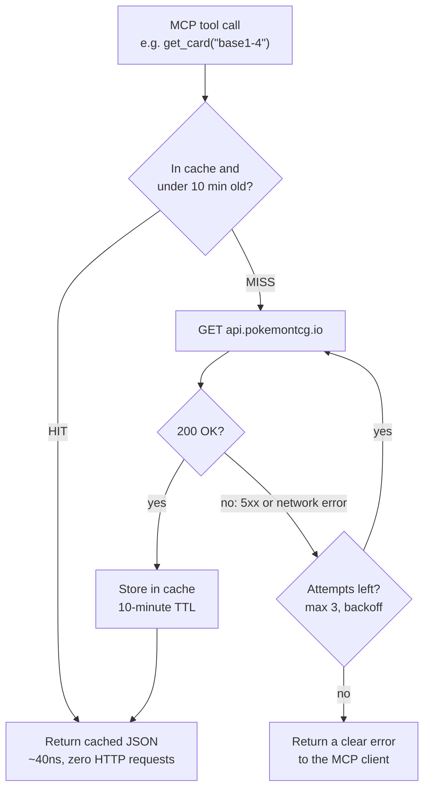

# pokemon-tcg-mcp

A small MCP server in Go that exposes the [Pokemon TCG API](https://pokemontcg.io)
(`pokemontcg.io`) as tools for any MCP client (Claude Desktop, Claude Code,
etc). Built as a portfolio piece to show MCP + Go — not tied to any
resale business, no overengineering.

## Why this one

Similar wrappers already exist in Python and TypeScript. Most of them are a
thin loop: MCP tool call in, HTTP GET out, every single time. This one isn't
— it's Go, and every tool call goes through one shared **in-memory cache with
a 10-minute TTL**, keyed on the full request URL. A repeated query within
that window never leaves the process.

That matters more than it sounds for this specific API:

- **pokemontcg.io has no required API key**, which means requests are rate
  limited by IP (1000/day, 30/min) with no visibility into how much of that
  quota is left — you just start getting throttled. If you share a network
  (home, office, VPN), everyone on it shares that same invisible budget.
- **The API itself is flaky.** [pokemontcg.io is now legacy](https://pokemontcg.io/)
  — the team's energy visibly moved to their commercial product, Scrydex —
  and it shows: plain, unauthenticated `GET` requests return an empty-bodied
  `500` somewhere between 10% and 50% of the time depending on the moment,
  confirmed with repeated `curl` tests independent of this project's code.
- **MCP conversations re-ask the same thing constantly.** An LLM client
  checking a card, then referencing it two turns later, or listing sets
  once per session, is the normal usage pattern — not the exception.

So the cache isn't a nice-to-have, it's what keeps this server usable against
a rate-limited, unreliable upstream. A second `get_card("base1-4")` doesn't
place a second bet against a coin-flip API — it's a map lookup that can't
fail. And when a request *does* miss the cache, `fetchJSON` retries
transient `5xx`/network errors up to 3 times with backoff before giving up,
so a client only ever sees an error when the upstream has genuinely failed
three times in a row.



The receipts, measured on this machine:

| Path | Latency |
|---|---|
| Cache hit (`cache.get`, mutex + map lookup) | ~40 ns (benchmarked, `b.N=200000`) |
| Cache miss (network round trip to pokemontcg.io) | ~150–650 ms when it succeeds — and it doesn't always succeed on the first try |

That's the whole pitch: a cache miss is a bet against a flaky API, and a
cache hit is a guaranteed win — several million times faster.

## Tools

1. **`search_cards(name, set?, page?)`** — search cards by name, optionally
   filtered by set name. Returns a trimmed list: id, name, set, number,
   rarity, small image URL.
2. **`get_card(id)`** — full detail for one card by id (e.g. `base1-4`):
   name, set, rarity, artist, large image URL, and TCGPlayer market price
   if available.
3. **`list_sets(series?)`** — list sets, most recent first, optionally
   filtered by series name.
4. **`get_set(id)`** — full detail for one set by id (e.g. `base1`): name,
   series, release date, printed/total card counts, PTCGO code, logo image.
5. **`get_card_prices(id)`** — full raw price breakdown for one card:
   TCGPlayer (USD, by finish) and Cardmarket (EUR). No graded (PSA/BGS)
   prices — the API doesn't have that data.
6. **`get_card_legality(id)`** — Standard/Expanded/Unlimited tournament
   legality for one card.
7. **`list_types()`** — all Pokemon TCG energy types (Fire, Water, etc).
8. **`list_subtypes()`** — all card subtypes (Stage 1, VMAX, EX, etc).
9. **`list_supertypes()`** — Pokemon, Trainer, Energy.
10. **`list_rarities()`** — all card rarities (Common, Rare Holo, etc).

## Running it

```bash
go mod tidy
go run .                              # runs on stdio
go build -o pokemon-tcg-mcp .         # binary for Claude Desktop config
go vet ./...
```

Or with `make` (`make help` lists every target):

```bash
make build          # Linux/macOS binary
make build-windows  # cross-compiled .exe for Claude Desktop on Windows
make check          # fmt-check + vet + test, before committing
```

No API key is required for light usage (1000 requests/day, 30/min). To raise
that limit, set `POKEMONTCG_API_KEY` in the environment — never commit it.

## Claude Desktop config

```json
{
  "mcpServers": {
    "pokemon-tcg": {
      "command": "/absolute/path/to/pokemon-tcg-mcp"
    }
  }
}
```

## Running on a legacy API — and the path off it

This server talks to `pokemontcg.io` v2, the free, unauthenticated API
described above. As of this writing, that API is in maintenance mode: its
team's energy has visibly moved to [Scrydex](https://scrydex.com/), a paid
successor covering the same Pokémon card/set data plus more games. That
shift is the most likely root cause of the intermittent 500s `fetchJSON`
retries around — a free legacy service with no one actively firefighting it.

pokemontcg.io still works and is still free, so it's the right call for a
v1/portfolio project: no signup, no cost, no vendor lock-in. If the error
rate keeps climbing, migrating `baseURL` in `main.go` to Scrydex is the
natural fix — but it isn't a drop-in swap. Scrydex requires an API key
(paid, credit-based, not a free tier) and its response schema's
compatibility with pokemontcg.io v2 isn't verified here. That's a real
trade — paid and less-tested vs. free and flaky — not worth making until
the current retry-and-cache approach stops being good enough.
